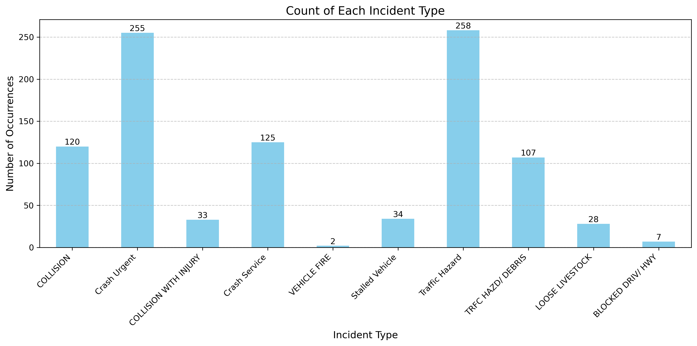
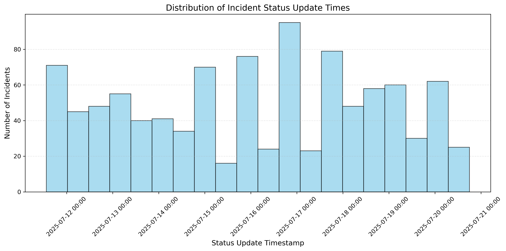
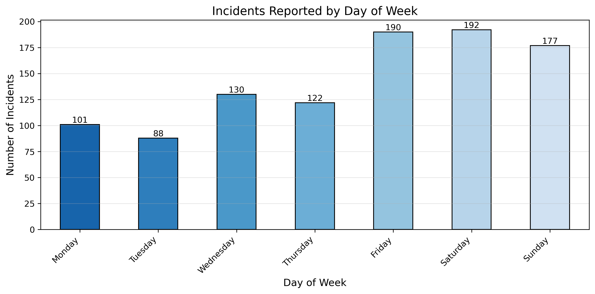
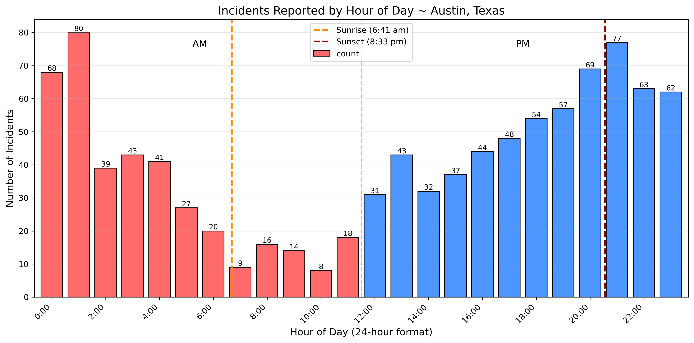
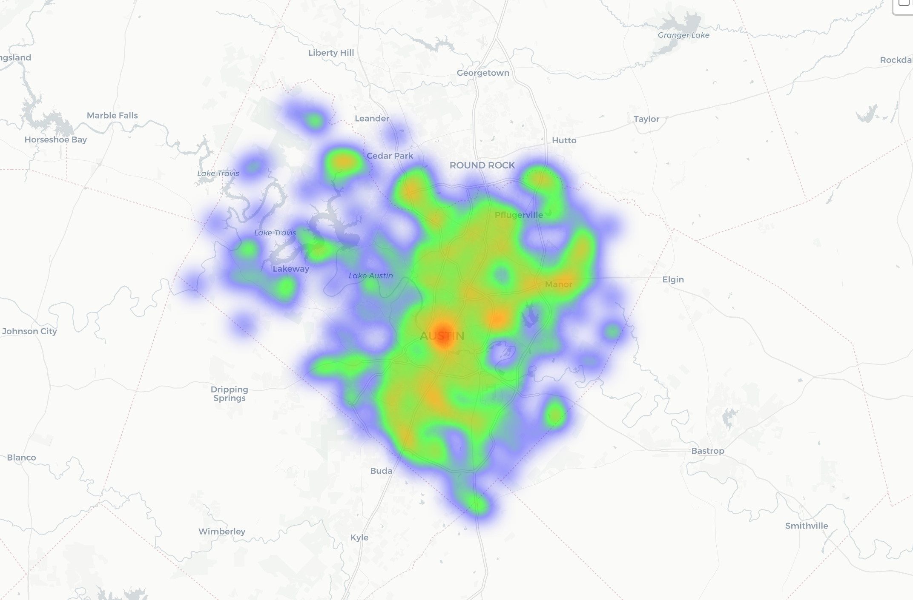

# austin_traffic_report
**A traffic report of the last 1000 reported traffic incidents from the City of Austin's Open Data Portal**

## Functions

### 1. See the incidents by type



**We can see that a large amount of the incidents reports are collisions or traffic hazard reports!**

### 2. See number and times of last 1k incidents reported



**On this view, we can see the fluctation of incidents in our last 1,000 reported incidents. This may imply that there is not a very consistent pattern in traffic accidents in the day to day.**

### 3.  See the incidents by Day of the Week



**Here, we can see that Friday, Saturday, and Sunday have significantly more incidents reported compared to other days of the week.**

### 4. See the incidents by Time of Day



**Analysis:**

- **From Sunset until 2am, this is a dangerous time to be on the road!**
- **Then, incidents reported fall from 2am until 7am.**
- **There is lull in traffic incidents reported from 7am to 11am.**
- **We then see the interesting steady incline from 2pm until 9pm. Presumably when people are getting off of work, getting kids from school, driving home from happy hour, or doing chores.**

### 5. See the incidents Geospatially with a Heatmap

Still screenshot Example



### 6. Run this report yourself

## Run This Report

Folder file system will come out as 

```
~/Downloads/austin_traffic_analysis/
  ├── traffic_report.ipynb
  ├── requirements.txt
  └── output/
      └── traffic_report.html
```

**Mac/Linux:**
```bash
cd ~/Downloads
git clone https://github.com/uploadtigris/austin_traffic_report.git
cd austin_traffic_report
bash run_analysis.sh python3 -m pip install jupyter && bash run_analysis.sh
```
```bash
bash run_analysis.sh
```

**Windows:**
```bash
git clone https://github.com/uploadtigris/austin_traffic_report.git
cd austin_traffic_report && py -m pip install jupyter
bash run_analysis.sh
```


